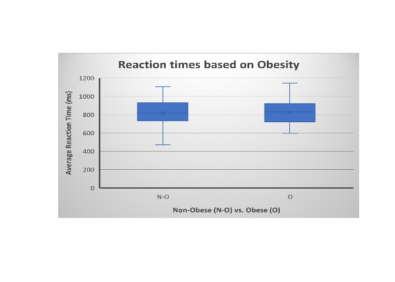
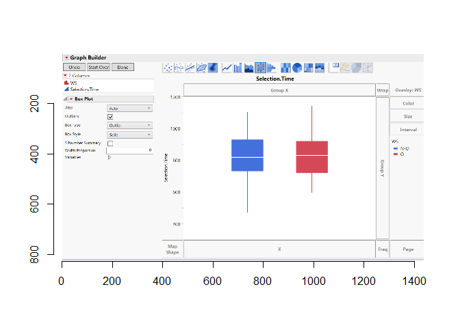
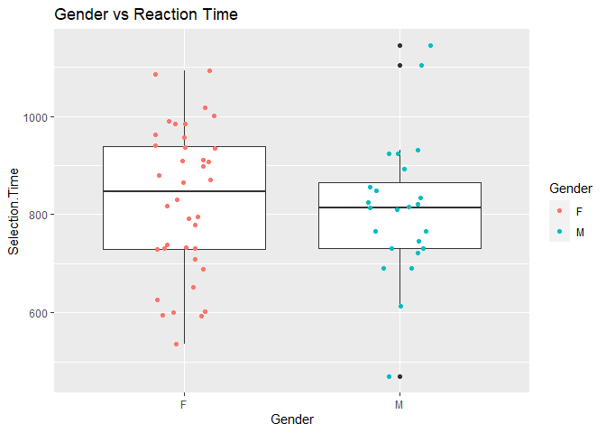
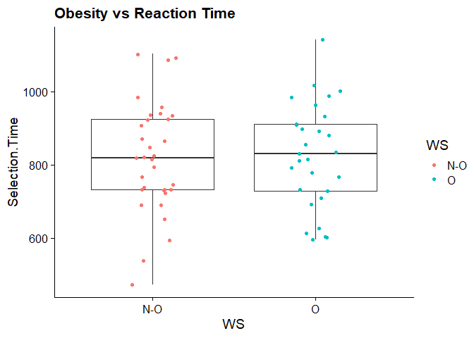
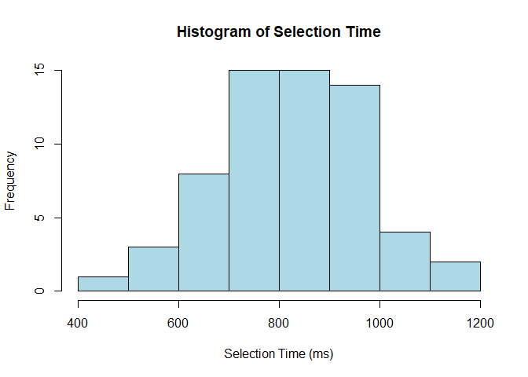

Group Project 1
================
Prof. Ken Field
9 Feb 2022

**Introduction** Public health relies on communication between
researchers, those that implement policies, and the public. By being
able to visualize data that is understandable to multiple audiences is
more effective in making change in communities. Choosing the right data
visualization platform is half the battle. We suggest using R in order
to effectively visualize data and perform necessary statistical
analysis. R is an “all-in-one” program, meaning once your data is
uploaded you can complete all your tasks (data wrangling and
visualization, editing, statistical analyses) within that program.

For this tutorial, we will be using a data set from a research study
testing arithmetic skills in non-obese and obese preteens. Each
participant had a 1400 ms window to choose 1 of 3 solutions for a
presented math problem. Participants answered a total of 240 math
problems which we have averaged for all 62 participants to create the
variable Selection.Time.

**Getting Started** When first opening an RMD file, we have to load
particular packages in order to do more with R. Like other programs, R
has basic tools, but for advanced visualizations and to utilize extra
features you need to load files specific for your project. This includes
packages such as “tidy verse”, which you may be using often. This
creates an easier workflow for data scientist by incorporating multiple
packages into one. In this particular project we also utilized
“readbitmap”, “imager” and “cowplot”.  
**Load packages**

**Reading in our data** We begin by loading our data table into R.

``` r
Data <- read_csv("0besity .csv")
```

    ## Rows: 62 Columns: 7

    ## -- Column specification --------------------------------------------------------
    ## Delimiter: ","
    ## chr (4): participant_id, Gender, WS, Performance
    ## dbl (3): Age, BMI, Selection.Time

    ## 
    ## i Use `spec()` to retrieve the full column specification for this data.
    ## i Specify the column types or set `show_col_types = FALSE` to quiet this message.

``` r
#PeerGroups1 %>% 
  #select(-MAJR, -CLAS, ) %>%
  #print()
```

**Why is R useful? - An example** Other programs such as Excel or JMP
can complete one or two of these tasks but it’s much more clunky and
some tasks are just not possible. To highlight how R is different from
other programs we have included some examples.

**Example Figure 1 using Excel:**

``` r
library("jpeg")
Excel <- readJPEG("ExcelGraph.jpg",native=TRUE)
plot(0:1,0:1,type="n",ann=FALSE,axes=FALSE)
rasterImage(Excel,0,0,1,1)
```

<!-- --> This is
about as fancy as you can get for a figure using Excel and although it’s
not too bad, Excel can get clunky trying to work with data.
Additionally, we can’t run statistical analyses using Excel.

**Example Figure 2 using JMP pro 16:**

``` r
library(imager)
JMP<-load.image("JMPproGraph.png")
plot(JMP)
```

<!-- --> Example 2
is from a statistical analysis program called JMP (“Jump”). The function
pictured is called “Graph Builder” and it’s a great way to visualize
data before running an analysis. However, there is no way to make a nice
professional figure in JMP. The figure pictured is as fancy as you can
make a figure in JMP and you can’t label axes or export this as a jpeg.
In this case, it’s kind of opposite of Excel: you can wrangle data and
run analyses on it, but can’t make nice figures.

As you can see, programs such as Excel and JMP are quite limited in the
tools you can use to perform data analyses. Below we will be
demonstrating how you can perform statistical and data visualization
tasks in R.

**Example Figure 3 using RStudio:**

``` r
Fig3<-ggplot(Data) +
  aes(x = Gender, y= Selection.Time) +
  geom_boxplot() +
  geom_jitter(width=.15, aes(color= Gender)) +
  ggtitle("Gender vs Reaction Time ") 
  theme_cowplot() +
  theme(axis.text.x = element_text(angle = 0, vjust = 1, hjust=0.5))

``` r
  Fig3
```

<!-- --> **View the
data**

First we want to understand our data. We have to check for
irregularities, missing values, or anything that would make our data
invalid. Within the data set testing arithmetic skills in obese and
non-obese preteens, the researchers provided us with a ton of data. We
first organized the data file from 62 participants selecting variables
such as gender, weight status (WS), selection time, age, and BMI. We
choose these variables as they may explain correlational patterns that
may be present after our statistical analysis.

We then need to familiarize ourselves with the data. The head() and
tail() functions give us a snapshot of the data from the top and bottom
of our data set. Here we can see that our data is divided by the
participants ID, Age, Gender, BMI, WS (Weight Status), and Selection
Time. So, we have now confirmed our selected variables have been
correctly loaded into R. We will also use summary() which provides even
more information about each specific variable. Things like finding the
min, max, and median values can quickly be performed utilizing this
function.

``` r
head(Data)
```

    ## # A tibble: 6 x 7
    ##   participant_id   Age Gender   BMI WS    Performance Selection.Time
    ##   <chr>          <dbl> <chr>  <dbl> <chr> <chr>                <dbl>
    ## 1 sub-01            10 M       16.0 N-O   H                     732.
    ## 2 sub-02            10 F       15.4 N-O   H                     732.
    ## 3 sub-03             9 F       18.5 N-O   L                     818.
    ## 4 sub-04            10 F       28.3 O     H                     601.
    ## 5 sub-05             9 M       30.0 O     L                    1143.
    ## 6 sub-06            10 M       25.5 O     H                     767.

``` r
tail(Data)
```

    ## # A tibble: 6 x 7
    ##   participant_id   Age Gender   BMI WS    Performance Selection.Time
    ##   <chr>          <dbl> <chr>  <dbl> <chr> <chr>                <dbl>
    ## 1 sub-57             9 F       31.7 O     H                     595.
    ## 2 sub-58            10 F       16.8 N-O   L                     935.
    ## 3 sub-59             9 M       29.7 O     L                     892.
    ## 4 sub-60             9 F       16.4 N-O   L                    1092.
    ## 5 sub-61             9 F       18.1 N-O   L                     936.
    ## 6 sub-62            10 F       15.1 N-O   L                     795.

``` r
summary(Data)
```

    ##  participant_id          Age            Gender               BMI       
    ##  Length:62          Min.   : 9.000   Length:62          Min.   :14.15  
    ##  Class :character   1st Qu.: 9.000   Class :character   1st Qu.:17.51  
    ##  Mode  :character   Median :10.000   Mode  :character   Median :19.26  
    ##                     Mean   : 9.548                      Mean   :21.66  
    ##                     3rd Qu.:10.000                      3rd Qu.:25.26  
    ##                     Max.   :10.000                      Max.   :37.36  
    ##       WS            Performance        Selection.Time  
    ##  Length:62          Length:62          Min.   : 471.0  
    ##  Class :character   Class :character   1st Qu.: 730.8  
    ##  Mode  :character   Mode  :character   Median : 819.7  
    ##                                        Mean   : 820.6  
    ##                                        3rd Qu.: 924.1  
    ##                                        Max.   :1143.4

Being a good data scientist means that we check if our data looks
similar to other resources and our questions are valid. In conjuction
with multiple articles, we know that it is valid to test and question
the correlation of obesity and one’s arithmetic skill level.

Now that we know what the data looks like, it’s time to ask some
questions, create a hypothesis, and make relevant predictions.

**Question:** *Is health related to cognitive ability?*

**Hypothesis:** *Residual effects of being overweight interfere with
mathematical skills*

**Prediction:** *People considered obese will take longer when asked to
solve problems on an arithmetic test. *

**Visualize the Data!**

To answer our questions, disprove or prove our hypothesis, and test our
predictions, we then have to organize the data in a readable graph and
perform statistical analysis. Data is more useful when visualized and
readable.

We first begin, by comparing obese and non-obese children and their
reaction times. (Simple right?). We choose to first analyze these two
variables as it is somewhere broad and easy to start. We can then graph
selection time (average time each participant took to answer) alongside
the WS variable ( weight status- either N-O for not obese, or O for
obese). Here we will use the ggplot package to enable us to graph and
visualize the data. While this code may look overwhelming, much of it is
for formatting and aesthetics. There are a few parts of this function
that we would like to call your attention to:

ggplot() - an imported package allowing for better data visualization

aes() - aesthetics function, helps to set x and y axis to our specified variables from out data set. For this particular graph, x           = WS, and  y = Selection.Time. It is important to spell these exactly as they are seen in the data set as R will not be able to c           all the variable if it cannot find it. 


geom_boxplot() - This function sets the type of graph we will be using. A boxplot is a great way to visualize data as it shows the          range of the data, min, max, quartiles, and median. In your own visualizations you can also utilize functions that create density           graphs, visualize error and an array of other graphical measures that suit your visualization purposes. These options can be found          online for tutorials specific to setting up gg_plot.

geom_jitter() - This geometry function plots the individual data points on top of our boxplots which is a good idea as it can help          the viewer see where the actual data points lie in relation to each other.

``` r
#set out graph equal to the variable firstGraph
firstGraph<-ggplot(Data) +
  aes(x = WS, y= Selection.Time) +
  geom_boxplot() +
  geom_jitter(width=.15, aes(color= WS)) +
  ggtitle("Obesity vs Reaction Time ") +
  theme_cowplot() +
  theme(axis.text.x = element_text(angle = 0, vjust = 1, hjust=0.5))
  
#call our firstGraph variable which runs the creation and outputs the graph
firstGraph
```

<!-- -->

**Interpet the results**

Now that we have visualized the data and can see them side by side, we
should run some statistical analyses to be able to tell whether or not
our prediction was quantitively correct.

With one continuous variable being tested against a categorical
variable, we can use a two-sample t-test to determine if the two are
significantly related to each other. In order to do this, we first must
ensure our selection times are distributed normally. We can use the
shapiro test to test for normality, a p-value above .05 will ensure out
data is distributed normally.

``` r
#Is our data normally distributed?
shapiro.test(Data$Selection.Time)
```

    ## 
    ##  Shapiro-Wilk normality test
    ## 
    ## data:  Data$Selection.Time
    ## W = 0.99107, p-value = 0.9336

``` r
hist(Data$Selection.Time, breaks = 8, xlab = "Selection Time (ms)", main = "Histogram of Selection Time", col = "light blue")
```

<!-- --> With a
p-value of .9336, we know our data is definitely normally distributed
and we can proceed with our t-test.

``` r
t.test(Data$Selection.Time ~ Data$WS, alternative = "two.sided", var.equal = FALSE)
```

    ## 
    ##  Welch Two Sample t-test
    ## 
    ## data:  Data$Selection.Time by Data$WS
    ## t = -0.1825, df = 59.564, p-value = 0.8558
    ## alternative hypothesis: true difference in means between group N-O and group O is not equal to 0
    ## 95 percent confidence interval:
    ##  -81.31824  67.72239
    ## sample estimates:
    ## mean in group N-O   mean in group O 
    ##          817.4265          824.2244

**Significance, outcomes, etc…** With a p-value of .8558, it seems there
is no correlation between obesity and selection time. This means our
initial prediction was incorrect and it appears obesity may have no
affect on arithmetic skills.

**Challenge your conclusions** Challenge your conclusions. Our results
may be due to a myriad of reasons. For one we also understand societal
and peer pressures that obese children face. Showing up academically may
be hard for more obese preteens at such a sensitive period in life. We
also have to understand the use of our data and its application to the
real world. There may be covert factors affecting the data such as
lifestyle, time spent studying, familial pressures, and individuals
having a range of interests that lay outside of academics. From our
conclusion we are now able to question other factors in low arithmetic
skill level in preteens.

#Always remember to give credit to the data collectors and other
authors:

Alatorre-Cruz, G.C., Downs, H., Hagood, D., Sorensen, S.T., Williams,
D.K., Larson-Prior, L. (2022). Effect of obesity on arithmetic
processing in preteens with high and low math skills. An event-related
potentials study. Frontiers in Human Neurosciences, In press.\\

# Acknowledgements

Narrative - Brooks, Cassie, Sierra Coding - Brooks, Sierra (boxplot
code: collaboration with Ashley Borseth; figure importing code:
<https://stackoverflow.com/questions/23861000/displaying-images-in-r-in-version-3-1-0>)

Question, Hypothesis, Predictions - Sierra, Brooks, Cassie Finding
dataset - Cassie
